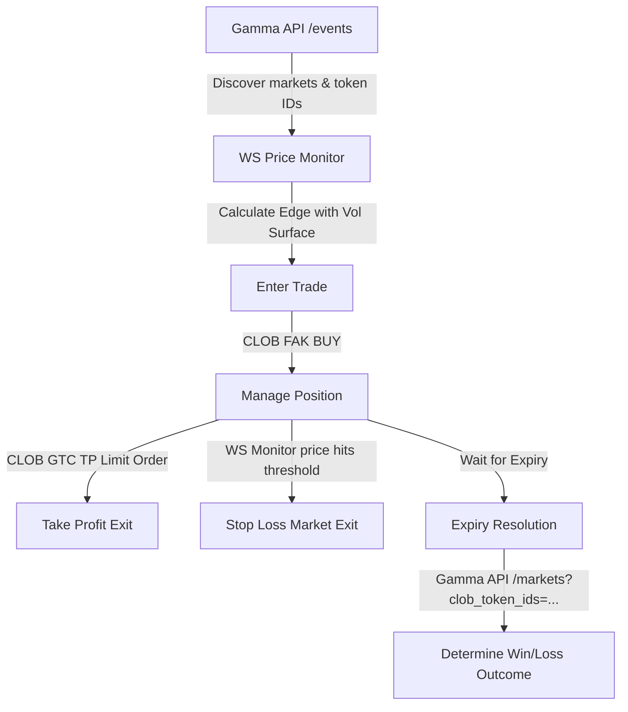

# Polymarket API Reference Guide

This document lists all the APIs, endpoints, SDK methods, WebSocket protocols, and data models used by the trading bot to interact with the **Polymarket** platform. You can use this guide as a complete blueprint for designing and developing future Polymarket trading daemons.

---

## 1. Overview of APIs and Endpoints

Polymarket is split into three main communication layers:

1. **Gamma API (`https://gamma-api.polymarket.com`):**
   Used for market discovery, event searches, reading descriptions, querying unresolved/resolved market structures, and locating on-chain condition IDs.
   
2. **CLOB API (`https://clob.polymarket.com`):**
   The Central Limit Order Book (CLOB). Used for order placement (market/limit), order book lookups, and checking ERC1155 token balances. Interactions are typically performed using the Python SDK.

3. **Websocket API (`wss://ws-subscriptions-clob.polymarket.com/ws/market`):**
   A real-time price feed server for subscribing to active bid/ask changes on specific outcome tokens.

---

## 2. Market & Event Discovery (Gamma API)

### A. Searching active/upcoming BTC events
To find active Bitcoin Up/Down markets, the bot queries `/events` using a date window to filter out expired listings:

*   **URL:** `GET https://gamma-api.polymarket.com/events`
*   **Query Parameters:**
    *   `active`: `"true"`
    *   `closed`: `"false"`
    *   `limit`: `100`
    *   `offset`: `0`
    *   `end_date_min`: `ISO_TIMESTAMP` (e.g. `2026-06-29T16:00:00Z`)
    *   `end_date_max`: `ISO_TIMESTAMP` (e.g. `2026-06-29T17:00:00Z`)

#### Example JSON response snippet:
```json
[
  {
    "id": "334272",
    "title": "Bitcoin Up or Down - June 29, 2:00PM-2:15PM ET",
    "description": "This market resolves to \"Up\" if the Bitcoin price at the end...",
    "endDate": "2026-06-29T18:15:00Z",
    "markets": [
      {
        "id": "1822773",
        "conditionId": "0x29789033e9636c68c85f55bc4731d6ffbe8f41d37caf0df655a383b626e29c23",
        "outcomes": "[\"Up\", \"Down\"]",
        "outcomePrices": "[\"0.52\", \"0.48\"]",
        "clobTokenIds": "[\"4332761835121366764639...\", \"23915543061184541907...\"]"
      }
    ]
  }
]
```

### B. Resolving Trade Outcomes by Token ID
If a trade has expired and you need to query the actual resolved outcome from Polymarket without paginating the entire CLOB, filter the markets by `clob_token_ids` directly:

*   **URL:** `GET https://gamma-api.polymarket.com/markets`
*   **Query Parameters:**
    *   `clob_token_ids`: `TOKEN_ID` (YES or NO token string)
    *   `closed`: `"true"` (or omit to check active markets)

*   **Logic:**
    If the endpoint returns a market payload where `closed` is `true`, look up the final payouts in `outcomePrices`:
    *   Find the index where price equals `1.0` or `"1"`.
    *   Compare the matching index in `clobTokenIds` with the purchased token. If it matches, the trade won.

---

## 3. Order Execution & Client SDK (CLOB API)

The bot utilizes the `py_clob_client_v2` library to interact with the CLOB.

### A. Initialization & Authentication
To execute trades, the client must be initialized using the Polygon trading wallet private key, API key credentials, and the L2 Gnosis Safe address (if utilizing a safe proxy):

```python
from py_clob_client_v2.client import ClobClient
from py_clob_client_v2.clob_types import MarketOrderArgsV2, PartialCreateOrderOptions, OrderArgs, BalanceAllowanceParams, AssetType
from py_clob_client_v2.order_builder.constants import BUY, SELL

client = ClobClient(
    host="https://clob.polymarket.com",
    chain_id=137,               # Polygon Mainnet
    key=private_key,            # Private key (EOA wallet or safe owner)
    signature_type=2,           # Type 2 for Gnosis Safe proxy, 1 for standard EOA wallet
    funder=funder_address,      # The Safe proxy address (if signature_type=2)
    use_server_time=True
)

# Derive or create API credentials (stored on Polymarket servers for session signing)
creds = client.derive_api_key() # or client.create_or_derive_api_key()
client.set_api_creds(creds)
```

### B. Fetching Order Book Bids and Asks
To ensure accurate execution pricing and verify your mathematical edge, retrieve the live order book of an outcome token:

```python
order_book = client.get_order_book(token_id)
# Response format:
# {
#   "bids": [{"price": "0.48", "size": "150.0"}, ...],
#   "asks": [{"price": "0.50", "size": "800.0"}, ...]
# }
```

### C. Executing Market Orders (Fill-And-Kill / FAK)
To enter or exit a position instantly, the bot uses `create_and_post_market_order` with an order type of `FAK`. For safety against rapid volatility, the bot applies a **1% slippage tolerance** to the execution price:

```python
# BUY (usdc_amount is in USDC)
safe_price = round(float(price) * 1.01, 4)  # 1% slippage buffer
order_args = MarketOrderArgsV2(
    token_id=token_id,
    amount=usdc_amount,
    side=BUY,
    price=safe_price
)
result = client.create_and_post_market_order(
    order_args,
    options=PartialCreateOrderOptions(tick_size="0.01", neg_risk=False),
    order_type="FAK"
)

# SELL (sell_size is in shares / tokens)
safe_price = round(float(price) * 0.99, 4)  # 1% slippage buffer
order_args = MarketOrderArgsV2(
    token_id=token_id,
    amount=sell_size,
    side=SELL,
    price=safe_price
)
result = client.create_and_post_market_order(
    order_args,
    options=PartialCreateOrderOptions(tick_size="0.01", neg_risk=False),
    order_type="FAK"
)
```

### D. Executing Take-Profit Limit Orders (Good-Til-Cancelled / GTC)
To exit positions automatically when target profits are met, place a standard limit maker order. 

```python
order_args = OrderArgs(
    token_id=token_id,
    price=tp_price,       # Target sell price (e.g. 0.75)
    size=shares_amount,   # Amount of tokens to sell
    side=SELL
)
result = client.create_and_post_order(
    order_args,
    options=PartialCreateOrderOptions(tick_size="0.01", neg_risk=False)
)
order_id = result.get("orderID") # Keep to allow cancel tracking
```

### E. Cancelling Active Orders
```python
# Accepts list of order IDs
client.cancel_orders([order_id])
```

### F. Querying Token Balances (ERC1155)
Polymarket positions exist as ERC1155 Conditional Tokens on Polygon. To query exact wallet positions, use the `get_balance_allowance` endpoint:

```python
params = BalanceAllowanceParams(
    asset_type=AssetType.CONDITIONAL,
    token_id=token_id
)
response = client.get_balance_allowance(params)
raw_balance = float(response.get("balance", 0.0))
# Balance is returned in 6 decimals (1 USDC share = 1,000,000 raw units)
actual_shares = raw_balance / 1000000.0
```

---

## 4. Real-Time Price Monitoring (WebSockets)

For fast-updating prices, use the websocket endpoint:
`wss://ws-subscriptions-clob.polymarket.com/ws/market`

### A. Connection Handshake
On opening the connection, send an initial subscription request containing the list of token IDs you want to track:
```json
{
  "assets_ids": ["TOKEN_ID_1", "TOKEN_ID_2"],
  "type": "market",
  "custom_feature_enabled": true
}
```

### B. Dynamically Subscribing/Unsubscribing
To change subscriptions as positions open or close:

*   **To Subscribe:**
    ```json
    {
      "assets_ids": ["NEW_TOKEN_ID"],
      "operation": "subscribe",
      "custom_feature_enabled": true
    }
    ```
*   **To Unsubscribe:**
    ```json
    {
      "assets_ids": ["OLD_TOKEN_ID"],
      "operation": "unsubscribe"
    }
    ```

### C. Message Parsing
The server will push bid/ask updates via two types of events.

1.  **`best_bid_ask` event:**
    ```json
    {
      "event_type": "best_bid_ask",
      "asset_id": "8124262341512151847584...",
      "best_bid": "0.48",
      "best_ask": "0.50"
    }
    ```
2.  **`price_change` event:**
    ```json
    {
      "event_type": "price_change",
      "price_changes": [
        {
          "asset_id": "8124262341512151847584...",
          "best_bid": "0.49",
          "best_ask": "0.51"
        }
      ]
    }
    ```

---

## 5. Direct CLOB HTTP Settlement Checks (Secondary Fallback)

If the Gamma API is slow, you can fetch settled outcomes directly from the CLOB HTTP engine:

*   **URL:** `GET https://clob.polymarket.com/markets/<condition_id>`
*   **Response parameters:**
    *   `closed`: `true` / `false`
    *   `tokens`: Array of Yes/No tokens. Look for `winner: true` or `price: 1` to find the winning option.

---

## 6. Summary Flow for Next Bot


